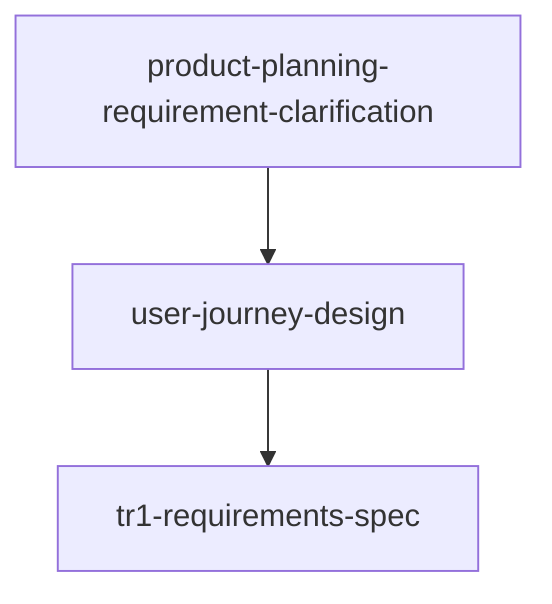

# cospec DAG Planner

**Skill 标识**: `cospec-dag-planner`

其他 skill 通过 `cospec-dag-planner` 引用本 skill。

本 skill 负责把一个 workflow entry skill 要编排的 leaf skills 转换为 cospec 风格的调度产物：`.cospec/runs/<RUN_DIR>/index.md`、`dag.json`、以及每个 skill-invoker 的 `task card`。

## When to Use

- A workflow entry skill has determined which leaf skills to run and their dependencies.
- The workflow entry skill wants to generate artifacts for `cospec-dag-executor` instead of writing them inline.

## Input Contract

Caller provides:

1. **workflow_name**: the workflow identifier.
2. **nodes**: a map of task id → `{skill, depends_on, description}`.
3. **output_dir**: `.cospec/runs/<RUN_DIR>/`.

## Output Contract

This skill writes:

```text
.cospec/runs/<RUN_DIR>/
  index.md              # human-readable workflow overview
  dag.json              # machine-readable skill DAG
  tasks/<task-id>.md    # per-skill task card
```

### `index.md` structure

```markdown
# [Workflow Name] Skill DAG

**Workflow:** [workflow_name]
**Goal:** [one sentence]

## Scheduling artifacts
- DAG: `.cospec/runs/<RUN_DIR>/dag.json`
- Task cards: `.cospec/runs/<RUN_DIR>/tasks/`

## Task DAG



## Tasks

### [task-id]
**Skill:** [skill-name]
**Task card:** `.cospec/runs/<RUN_DIR>/tasks/[task-id].md`
**Depends on:** [deps or "(none)"]
**Produces manifest:** `.cospec/runs/<RUN_DIR>/[task-id]/manifest.json`
```

### `dag.json` schema

```json
{
  "workflow": "<workflow_name>",
  "plan_file": ".cospec/runs/<RUN_DIR>/index.md",
  "tasks": [
    {
      "id": "product-planning-requirement-clarification",
      "task_file": ".cospec/runs/<RUN_DIR>/tasks/product-planning-requirement-clarification.md",
      "depends_on": [],
      "produces": [".cospec/runs/<RUN_DIR>/product-planning-requirement-clarification/manifest.json"]
    }
  ]
}
```

Each task must contain: `id`, `task_file`, `depends_on`, `produces`.

### Task card schema

```markdown
# Task: <task-id>

## Skill
<skill-name>

## Source
<workflow node description>

## Depends on
[task ids, or none]

## Input Artifacts
- [upstream manifest path, or none]

## Task Spec
[what this skill invocation should accomplish]

## Interface Contract
[expected output artifacts and formats]

## Acceptance Criteria
- No placeholders.
- Produces required artifacts.
- Consistent with upstream manifest contracts.

## Required Output Artifacts
- `.cospec/runs/<RUN_DIR>/<task-id>/manifest.json`
- `.cospec/runs/<RUN_DIR>/<task-id>/results.md`
```

## Workflow

1. Load the caller's node definitions.
2. Validate each node references an existing skill.
3. Build the DAG edge list.
4. Detect cycles.
5. Write `index.md`, `dag.json`, and `tasks/<task-id>.md`.
6. Return the plan directory path and task count.

## No Placeholder Rule

Plan artifacts must not contain:

- "TBD", "TODO", "稍后实现", "补充细节"
- "添加适当的..." / "处理边界情况"
- References to undefined skills or task ids

## Red Flags

- Do NOT create dependencies that are not in the caller's node definitions.
- Do NOT omit any task from `dag.json`.
- Do NOT dispatch the executor directly from this skill.
- Do NOT paste full skill bodies into task cards.

## Integration

```text
workflow entry skill
    -> cospec-dag-planner         (writes plan artifacts)
    -> [optional] cospec-dag-evaluator
    -> cospec-dag-executor        (dispatches skill-invoker subagents)
```

## Agent Prompt

Dispatch `skill-extractor` subagent using:
`skills/cospec-dag-planner/agents/skill-extractor-prompt.md`
