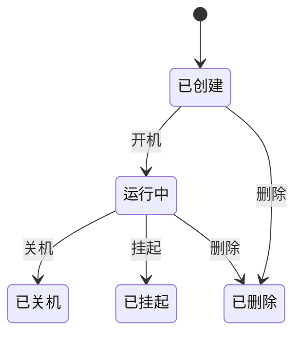

# 资产功能

## 一、功能卡片

| 字段 | 内容 |
| :--- | :--- |
| 功能 ID | F-ASSET |
| 目标角色 | Super Admin / 管理员 |
| 对应问题/Job | P-001 快速部署桌面和应用资源 / J-001 批量运维与升级 |
| 对应机会/需求 | R-001 ~ R-008 |
| 价值定位 | 门槛 |
| 目标版本 | VDI 5.9.8 EN |
| 优先级 | P0 |
| 状态 | 已发布 |

## 二、问题与目标

### 客户问题

IT 管理员需要统一管理虚拟机模板、桌面虚拟机、物理工作站、远程应用服务器、客户端、文件服务器和打印机等异构资产，但每类对象的配置字段、依赖关系、操作入口和权限规则各不相同，导致部署和运维复杂。

### 产品目标

- 客户结果：管理员可以在单一控制台完成资产的全生命周期管理，包括创建、编辑、关联、电源控制、升级和删除。
- 业务结果：降低桌面云部署和运维成本，提升资源交付效率。
- 非目标：`[OUT]` 当前梳理不涉及底层 HCI 或物理网络设备的直接管理。

### 证据

- `[EVIDENCE]` 资产模块包含 8 个子菜单，覆盖虚拟机模板、虚拟机、物理机、浮动池私有磁盘、远程应用服务器、客户端、文件服务器、打印机。
- `[ASSUMPTION]` 当前梳理基于 Super Admin 视角，普通管理员的可见范围待验证。

## 三、主场景

### 场景：发布虚拟桌面

- **场景说明**：管理员选择虚拟机模板，创建虚拟桌面资源并关联用户/角色，最终用户在客户端看到可用资源。
- **期望效果**：终端用户成功登录客户端并访问分配的虚拟桌面。
- **前置条件**：HCI 已对接、模板已导入、网络/域配置就绪。
- **触发方式**：管理员进入 资产 > 虚拟机模板 / 服务 > 资源。
- **主流程**：
  1. 准备或导入虚拟机模板。
  2. 在 服务 > 资源 中新建虚拟桌面资源，选择工作模式、模板、桌面类型。
  3. 配置域与单点登录、定时开关机等高级选项。
  4. 创建角色并关联用户和资源。
  5. 用户登录客户端验证资源可用性。
- **异常/替代流程**：
  - 模板与 HCI 集群不兼容 → 界面提示并阻断选择。
  - 资源未关联角色/用户 → 用户客户端不可见该资源。
- **完成状态**：用户在客户端看到并正常访问虚拟桌面。

### 场景：管理远程应用服务器

- **场景说明**：管理员基于模板批量创建或单台纳管远程应用服务器，用于发布远程应用和会话桌面。
- **期望效果**：远程应用状态页面可监控服务器、应用和会话运行状态。
- **前置条件**：已导入应用服务器模板或已知服务器 IP/端口。
- **触发方式**：资产 > 远程应用服务器 > 新建。
- **主流程**：
  1. 选择批量管理或单台管理模式。
  2. 配置服务器集合/名称、分组、模板、并发会话数、AD 域、电源计划。
  3. 保存后进入远程应用状态页签监控运行状态。
- **异常/替代流程**：
  - 模板 Agent 版本与 VDC 不一致 → 界面提示兼容性要求。
  - 单台模式服务器离线 → 列表显示异常状态。
- **完成状态**：服务器上线，可关联到资源发布。

## 四、需求规格约束

### 4.1 信息与字段

#### 虚拟机模板关键字段

| 字段 | 类型 | 必填 | 默认值 | 校验规则 | 权限/可见性 | 说明 |
| :--- | :--- | :---: | :--- | :--- | :--- | :--- |
| 名称 | String | 是 | - | 唯一 | Super Admin | 模板显示名称 |
| 分组 | Enum | 是 | 默认分组 | - | Super Admin | 模板归属分组 |
| 版本 | String | 否/是 | v1 | - | Super Admin | 首个版本默认 v1 |
| 版本描述 | String | 是 | - | - | Super Admin | 版本说明 |
| 集群 | Enum | 是 | - | 已对接 HCI | Super Admin | 源虚拟机/模板所在集群 |

#### 虚拟机关键字段

| 字段 | 类型 | 必填 | 默认值 | 校验规则 | 权限/可见性 | 说明 |
| :--- | :--- | :---: | :--- | :--- | :--- | :--- |
| 虚拟机名称 | String | 是 | - | 唯一 | Super Admin | 显示名称 |
| 关联用户 | Enum | 否 | 不关联但锁定/不关联且空闲/关联用户 | - | Super Admin | 决定分配方式 |
| IPv4/IPv6 地址方式 | Enum | 是 | 待确认 | 用户指定/DHCP/VDC 指定 | Super Admin | IP 分配方式 |
| 关联 Windows 自动更新策略 | Enum | 否 | 禁用 | - | Super Admin | 仅适用于 Windows 独享桌面 |

#### 物理机关键字段

| 字段 | 类型 | 必填 | 默认值 | 校验规则 | 权限/可见性 | 说明 |
| :--- | :--- | :---: | :--- | :--- | :--- | :--- |
| 名称 | String | 是 | - | 唯一 | Super Admin | 显示名称 |
| 关联用户模式 | Enum | 否 | 待确认 | 锁定/空闲/关联用户 | Super Admin | 与虚拟机一致 |

### 4.2 业务规则

1. 模板更新可能清空 HCI 快照，更新派生虚拟机会重置系统盘并导致数据丢失。
2. 存在基于模板创建的派生虚拟机时不可删除模板；可选同步删除 HCI 模板机和模板镜像。
3. 桌面模式边界：用户关联仅对专有桌面和还原桌面有效，对池桌面无效。
4. 远程应用服务器批量管理模式需要选择已导入 VDC 的模板；单台模式不显示模板、AD 域和电源计划配置。
5. 物理 PC 操作系统支持 Windows 10 x64 1809 及以上、Windows 11，且需配备 NVIDIA 独立显卡。

### 4.3 状态模型



### 4.4 权限矩阵

| 操作 | Super Admin | 普通管理员 | 受限管理员 |
| :--- | :---: | :---: | :---: |
| 查看资产列表 | ✅ | 待确认 | 待确认 |
| 新建/编辑资产 | ✅ | 待确认 | 待确认 |
| 删除资产 | ✅ | 待确认 | 待确认 |
| 电源管理 | ✅ | 待确认 | 待确认 |
| 导出/导入关联设置 | ✅ | 待确认 | 待确认 |

## 五、体验与原型

- 页面/入口：资产模块左侧分组树 + 右侧列表，顶部工具栏提供新建、删除、电源、任务等操作。
- 原型链接：待确认
- 空状态：当前环境部分模块无数据，显示空列表。
- 加载状态：列表支持刷新和自动刷新（客户端模块）。
- 错误状态：未选择对象时，变更类操作禁用；依赖对象缺失时表单字段禁用或提示。
- 成功反馈：保存/删除/电源操作后显示任务状态和结果。
- 可访问性/国际化：当前为 EN 控制台，中文控制台字段需重新核对。

## 六、数据与指标

### 埋点/事件

| 事件 | 触发时机 | 属性 | 用途 |
| :--- | :--- | :--- | :--- |
| asset_create | 新建资产提交 | 资产类型、来源 | 统计资产创建量 |
| asset_delete | 删除资产确认 | 资产类型、数量 | 统计资产删除量 |
| asset_power_op | 执行电源操作 | 操作类型、资产类型 | 统计运维操作量 |

### 成功指标

| 指标 | 基线 | 目标 | 时间窗口 | 护栏指标 |
| :--- | :--- | :--- | :--- | :--- |
| 资产创建成功率 | 待确认 | 待确认 | 待确认 | 待确认 |
| 模板部署平均时长 | 待确认 | 待确认 | 待确认 | 待确认 |
| 虚拟机异常率 | 待确认 | 待确认 | 待确认 | 待确认 |

## 七、验收示例

```gherkin
场景: 成功创建虚拟桌面资源
  假如 已存在可用的虚拟机模板和 HCI 集群
  当 管理员在 服务 > 资源 中新建虚拟桌面并保存
  那么 资源列表中显示新资源，且关联用户可在客户端看到该资源
```

```gherkin
场景: 删除被依赖的模板
  假如 模板下存在派生虚拟机
  当 管理员尝试删除该模板
  那么 系统提示存在依赖并阻止删除，或提供同步删除选项
```

## 八、依赖、风险与待细化项

- 依赖：HCI 平台、AD/LDAP 域、文件存储服务器、网络/防火墙配置。
- 风险：模板更新/删除导致数据丢失；电源操作影响在线用户；Agent 版本不一致导致兼容性问题。
- `[OPEN]` 普通/受限管理员的资产权限边界。
- `[OPEN]` 容量限制（CPU、内存、磁盘、GPU 热扩容上限、批量操作上限）。
- `[BLOCKED]` 部分删除/电源操作的结果验证依赖允许变更的测试环境。
