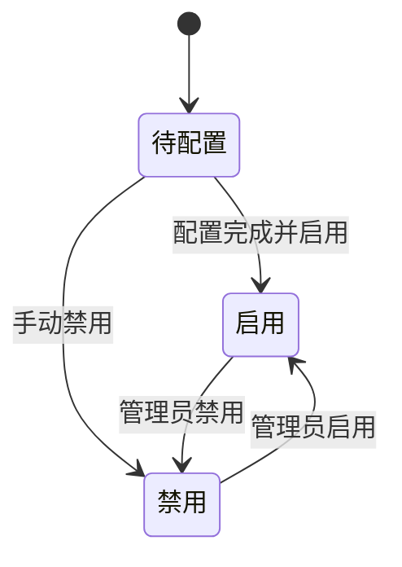

# 服务功能

## 一、功能卡片

| 字段 | 内容 |
| :--- | :--- |
| 功能 ID | F-SERVICE |
| 目标角色 | Super Admin / 管理员 |
| 对应问题/Job | P-002 统一管理用户与认证 / J-002 精细化访问控制 |
| 对应机会/需求 | R-009 ~ R-014 |
| 价值定位 | 门槛 |
| 目标版本 | VDI 5.9.8 EN |
| 优先级 | P0 |
| 状态 | 已发布 |

## 二、问题与目标

### 客户问题

管理员需要将虚拟桌面、远程应用、会话桌面、物理机等资源发布给终端用户，并管理用户、角色和多种认证方式。认证模块包含 14 个认证子页，配置组合复杂，容易出错。

### 产品目标

- 客户结果：管理员可以完成资源发布、用户生命周期管理、角色授权和多因素认证配置。
- 业务结果：保障正确的用户以正确的方式访问正确的资源。
- 非目标：`[OUT]` 当前梳理未覆盖客户端侧的用户登录体验细节。

### 证据

- `[EVIDENCE]` 服务模块包含 7 个子菜单：资源、用户、角色、认证、行业应用、文件、软件分发。
- `[EVIDENCE]` 认证模块包含 14 个认证子页：密码安全、外部 LDAP/RADIUS、证书/USB Key、客户端域单点登录、aTrust、外部认证、短信认证、动态令牌、硬件 ID、本地密码、TOTP、统一认证、联邦认证、第三方连接。
- `[ASSUMPTION]` 认证组合需要产品/安全团队确认推荐方案。

## 三、主场景

### 场景：创建用户并分配资源

- **场景说明**：管理员创建本地用户，配置主/次认证方式，分配角色，使用户可登录客户端访问资源。
- **期望效果**：用户使用配置的凭据成功登录并看到已授权资源。
- **前置条件**：用户认证方式所需的后端服务已配置（如 LDAP、短信网关、CA 等）。
- **触发方式**：服务 > 用户 > 新建。
- **主流程**：
  1. 填写基础身份（名称、密码、手机号、分组、区域）。
  2. 配置主认证（本地密码/证书/USB Key/统一认证/外部 LDAP/RADIUS/动态令牌，全部满足或任一满足）。
  3. 配置次认证（硬件 ID、短信认证、动态令牌、TOTP）。
  4. 分配角色。
  5. 用户登录客户端验证。
- **异常/替代流程**：
  - 未指定 CA → 凭据页提示未指定 CA。
  - 认证服务器不可达 → 登录失败或按缓存凭据策略处理。
- **完成状态**：用户成功登录并访问资源。

### 场景：发布远程应用资源

- **场景说明**：管理员创建远程应用资源，配置服务器、程序路径、启动参数等，供用户通过客户端访问。
- **期望效果**：用户在客户端看到并启动远程应用。
- **前置条件**：已存在远程应用服务器且应用已安装。
- **触发方式**：服务 > 资源 > 新建远程应用资源。
- **主流程**：
  1. 填写基础信息（名称、分组、区域、启用状态）。
  2. 选择策略类型、Agent 协议、服务器、程序路径、应用程序、图标。
  3. 配置高级设置（窗口启动模式、应用实例限制、快捷方式、文件关联、嵌套资源显示策略）。
  4. 保存资源并关联角色/用户。
- **异常/替代流程**：
  - 2D 远程应用需要银牌及以上许可；3D 远程应用和物理机需要白金许可。
- **完成状态**：用户客户端显示远程应用并可启动。

## 四、需求规格约束

### 4.1 信息与字段

#### 用户关键字段

| 字段 | 类型 | 必填 | 默认值 | 校验规则 | 权限/可见性 | 说明 |
| :--- | :--- | :---: | :--- | :--- | :--- | :--- |
| 名称 | String | 是 | - | 唯一 | Super Admin | 用户名 |
| 密码 | String | 是 | - | 复杂度策略 | Super Admin | 本地密码 |
| 手机号 | String | 否 | - | 格式校验 | Super Admin | 短信认证依赖 |
| 分组 | Enum | 是 | 默认组 | - | Super Admin | 用户组 |
| 主认证方式 | Multi-Enum | 是 | 待确认 | 至少一种 | Super Admin | 本地密码/证书/USB Key/统一认证/外部 LDAP/RADIUS/动态令牌 |
| 次认证方式 | Multi-Enum | 否 | 待确认 | - | Super Admin | 硬件 ID/短信认证/动态令牌/TOTP |

#### 角色关键字段

| 字段 | 类型 | 必填 | 默认值 | 校验规则 | 权限/可见性 | 说明 |
| :--- | :--- | :---: | :--- | :--- | :--- | :--- |
| 角色名称 | String | 是 | - | 唯一 | Super Admin | 角色显示名称 |
| 对象 | Multi-Enum | 是 | - | 本地用户/域用户/安全组 | Super Admin | 角色适用对象 |
| 接入安全策略 | Enum | 否 | - | - | Super Admin | 关联接入安全策略 |
| 资源 | Multi-Select | 否 | - | - | Super Admin | 关联资源列表 |

#### 资源关键字段（虚拟桌面）

| 字段 | 类型 | 必填 | 默认值 | 校验规则 | 权限/可见性 | 说明 |
| :--- | :--- | :---: | :--- | :--- | :--- | :--- |
| 名称 | String | 是 | - | 唯一 | Super Admin | 资源名称 |
| 工作模式 | Enum | 是 | - | 桌面/远程应用/物理机 | Super Admin | 资源类型 |
| 桌面类型 | Enum | 是 | - | 持久/非持久 | Super Admin | 桌面模式 |
| 虚拟机类型 | Enum | 是 | - | 链接克隆/完整克隆 | Super Admin | 克隆方式 |
| CPU 核数 | Integer | 是 | 待确认 | 1-32 | Super Admin | - |
| 内存 | Integer | 是 | 待确认 | 1-254 GB | Super Admin | - |
| 私有磁盘 | Boolean/Integer | 否 | 不创建 | 1-2048 GB | Super Admin | 是否创建及容量 |

### 4.2 业务规则

1. 2D 远程应用需要银牌及以上许可；3D 远程应用和物理机需要白金许可。
2. 角色可关联本地用户、域用户、安全组；从模板创建角色前必须先选择现有角色。
3. 主认证可设置为“全部满足”或“任一满足”。
4. 用户分组统计展示直接/全部子组数量和直接/全部用户数量。
5. 行业应用当前未启用，需前往“系统 > 控制台选项”启用。

### 4.3 状态模型



### 4.4 权限矩阵

| 操作 | Super Admin | 普通管理员 | 受限管理员 |
| :--- | :---: | :---: | :---: |
| 查看用户/角色/资源 | ✅ | 待确认 | 待确认 |
| 新建/编辑用户/角色/资源 | ✅ | 待确认 | 待确认 |
| 删除用户/角色/资源 | ✅ | 待确认 | 待确认 |
| 配置认证模块 | ✅ | 待确认 | 待确认 |
| 导入/导出用户 | ✅ | 待确认 | 待确认 |

## 五、体验与原型

- 页面/入口：服务模块左侧用户组/资源组树 + 右侧列表，顶部工具栏提供新建、编辑、删除、导入、导出、关联等操作。
- 原型链接：待确认
- 空状态：未配置文件存储服务器时文件库显示不可用；未启用行业应用时提示启用。
- 加载状态：列表支持搜索、刷新、分页。
- 错误状态：依赖服务未配置时表单字段禁用或提示（如未指定 CA、未配置文件服务器）。
- 成功反馈：保存后返回列表并刷新。
- 可访问性/国际化：EN 控制台，中文需重新核对。

## 六、数据与指标

### 埋点/事件

| 事件 | 触发时机 | 属性 | 用途 |
| :--- | :--- | :--- | :--- |
| user_create | 新建用户保存 | 认证方式、分组 | 统计用户创建 |
| role_create | 新建角色保存 | 对象类型、资源数 | 统计角色创建 |
| resource_create | 新建资源保存 | 工作模式、桌面类型 | 统计资源发布 |
| auth_config_save | 认证配置保存 | 认证类型 | 统计认证配置变更 |

### 成功指标

| 指标 | 基线 | 目标 | 时间窗口 | 护栏指标 |
| :--- | :--- | :--- | :--- | :--- |
| 用户登录成功率 | 待确认 | 待确认 | 待确认 | 待确认 |
| 资源发布成功率 | 待确认 | 待确认 | 待确认 | 待确认 |
| 认证失败率 | 待确认 | 待确认 | 待确认 | 待确认 |

## 七、验收示例

```gherkin
场景: 成功创建本地用户并分配角色
  假如 已存在角色和资源
  当 管理员新建本地用户并分配角色
  那么 用户可使用本地密码登录并看到授权资源
```

```gherkin
场景: 未指定 CA 时创建 USB Key 凭据
  假如 未配置外部 CA
  当 管理员尝试为用户创建 USB Key
  那么 页面提示“未指定 CA”
```

## 八、依赖、风险与待细化项

- 依赖：AD/LDAP/RADIUS 服务器、短信网关、CA/USB Key 驱动、文件存储服务器、远程应用服务器、应用服务器模板。
- 风险：认证配置错误导致用户无法登录；角色-资源关联错误导致权限泄露或访问失败；许可不足导致高级功能不可用。
- `[OPEN]` 14 种认证方式的推荐组合与互斥规则。
- `[OPEN]` 普通/受限管理员的菜单与操作权限差异。
- `[BLOCKED]` 行业应用、文件库完整能力依赖环境启用/配置。
