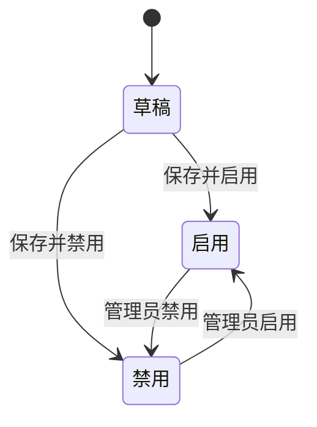

# 策略功能

## 一、功能卡片

| 字段 | 内容 |
| :--- | :--- |
| 功能 ID | F-POLICY |
| 目标角色 | Super Admin / 管理员 |
| 对应问题/Job | P-003 精细化访问控制 / J-003 保障数据安全与外发合规 |
| 对应机会/需求 | R-015 ~ R-018 |
| 价值定位 | 差异化 |
| 目标版本 | VDI 5.9.8 EN |
| 优先级 | P0 |
| 状态 | 已发布 |

## 二、问题与目标

### 客户问题

企业需要按用户、角色、虚拟机、客户端环境、时间、IP 等维度统一配置虚拟桌面、远程应用、物理机的访问策略，并定制登录主题和门户。

### 产品目标

- 客户结果：管理员可以通过策略集统一配置账号、虚拟桌面、远程应用和物理机的访问策略，并通过主题/门户定制用户体验。
- 业务结果：提升安全控制力和用户体验一致性。
- 非目标：`[OUT]` 当前梳理未覆盖分布式防火墙启用后的规则表单细节。

### 证据

- `[EVIDENCE]` 策略模块包含四个一级子菜单：策略集、主题、对象、分布式防火墙。
- `[EVIDENCE]` 策略集包含账号选项、虚拟与本地桌面策略（13 个子页）、远程应用与会话桌面策略、物理机策略。
- `[ASSUMPTION]` 多个策略命中同一对象时的优先级和合并规则需要进一步验证。

## 三、主场景

### 场景：配置策略集

- **场景说明**：管理员新建策略集，选择对象并配置账号、桌面、应用、物理机等策略选项。
- **期望效果**：策略命中对象后，终端用户获得对应的桌面/应用访问体验。
- **前置条件**：已维护应用库、IP 组、时间计划等对象。
- **触发方式**：策略 > 策略集 > 新建。
- **主流程**：
  1. 配置基础信息（名称、区域、优先级、对象）。
  2. 配置账号选项（登录时间、IP 组、断开连接注销、最大硬件 ID 数量等）。
  3. 配置虚拟与本地桌面策略（基础、PC/USB 设备、外发审计、虚拟盘、加速、应用访问控制、系统优化、视频重定向、配置文件重定向、自助服务、兼容性、Windows 优化）。
  4. 配置远程应用与会话桌面策略。
  5. 配置物理机策略。
  6. 保存策略集。
- **异常/替代流程**：
  - 对象已被其他策略集关联 → 需确认策略优先级。
- **完成状态**：策略集生效，对象访问时按策略执行。

### 场景：定制门户主题

- **场景说明**：管理员选择或上传主题模板，定制组织名称、公告、首选登录方式等。
- **期望效果**：用户登录客户端或 Web 门户时看到定制界面。
- **前置条件**：已准备主题文件或 ZIP 包。
- **触发方式**：策略 > 主题。
- **主流程**：
  1. 选择客户端主题或 Web 门户模板。
  2. 编辑主题字段（名称、描述、组织名称、公告消息、首选登录方式）。
  3. 上传自定义门户 ZIP（如需）。
  4. 保存并预览。
- **异常/替代流程**：
  - ZIP 目录不符合规范 → 上传失败或解压异常。
- **完成状态**：客户端/Web 门户显示定制主题。

## 四、需求规格约束

### 4.1 信息与字段

#### 策略集关键字段

| 字段 | 类型 | 必填 | 默认值 | 校验规则 | 权限/可见性 | 说明 |
| :--- | :--- | :---: | :--- | :--- | :--- | :--- |
| 名称 | String | 是 | - | 唯一 | Super Admin | 策略集名称 |
| 区域 | Enum | 是 | 默认区域 | - | Super Admin | 管理区域 |
| 优先级 | Enum | 是 | 位于第一条策略下方 | - | Super Admin | 插入位置 |
| 对象 | Multi-Select | 是 | - | 本地用户/虚拟机/域用户/安全组 | Super Admin | 策略适用对象 |
| 状态 | Enum | 是 | 启用 | 启用/禁用 | Super Admin | - |

#### 主题模板关键字段

| 字段 | 类型 | 必填 | 默认值 | 校验规则 | 权限/可见性 | 说明 |
| :--- | :--- | :---: | :--- | :--- | :--- | :--- |
| 名称 | String | 是 | - | 内置主题不可修改 | Super Admin | 主题名称 |
| 组织名称 | String | 否 | - | - | Super Admin | 显示组织 |
| 公告消息 | String | 否 | - | HTML，最大 1024 字符 | Super Admin | 登录页公告 |
| 首选登录方式 | Enum | 否 | - | - | Super Admin | 默认登录方式 |

#### 对象关键字段

| 对象类型 | 字段 | 说明 |
| :--- | :--- | :--- |
| 应用库 | 名称、应用类型、描述、进程名称 | 预定义/自定义应用 |
| IP 组 | 名称、描述、IP 地址 | 每行一个 IP 或范围；内置“全部 IP” |
| 时间计划 | 名称、描述、每周时间网格 | 周一至周日 00:00-24:00 |

### 4.2 业务规则

1. 默认策略集应用于未关联其他策略集的对象，不能排序或删除。
2. 编辑已有策略时名称不可修改；区域、对象、状态、描述和策略选项可编辑。
3. 对象详情弹窗支持本地用户、虚拟机、域用户、安全组四类页签。
4. 外发内容审计、虚拟盘、配置文件重定向依赖文件存储/虚拟盘和报表中心配置。
5. 分布式防火墙未启用时无法下钻规则表单；启用/重置可能影响网络访问。

### 4.3 状态模型



### 4.4 权限矩阵

| 操作 | Super Admin | 普通管理员 | 受限管理员 |
| :--- | :---: | :---: | :---: |
| 查看策略集 | ✅ | 待确认 | 待确认 |
| 新建/编辑策略集 | ✅ | 待确认 | 待确认 |
| 删除策略集 | ✅ | 待确认 | 待确认 |
| 配置主题/门户 | ✅ | 待确认 | 待确认 |
| 管理对象（应用库/IP 组/时间计划） | ✅ | 待确认 | 待确认 |
| 启用/重置分布式防火墙 | ✅ | 待确认 | 待确认 |

## 五、体验与原型

- 页面/入口：策略模块左侧分组树 + 右侧列表，策略集编辑为多页签表单。
- 原型链接：待确认
- 空状态：对象库初始为空时显示空列表。
- 加载状态：策略列表支持搜索、刷新、分页、列设置。
- 错误状态：依赖未配置时对应策略选项不可用（如未配置文件服务）。
- 成功反馈：保存后返回列表并显示新策略集。
- 可访问性/国际化：EN 控制台，中文需重新核对。

## 六、数据与指标

### 埋点/事件

| 事件 | 触发时机 | 属性 | 用途 |
| :--- | :--- | :--- | :--- |
| policy_set_create | 新建策略集 | 对象类型、策略域数量 | 统计策略创建 |
| policy_set_update | 编辑策略集 | 变更策略域 | 统计策略变更 |
| theme_import | 导入主题 | 主题类型 | 统计主题定制 |
| dfw_enable | 启用分布式防火墙 | - | 统计安全能力启用 |

### 成功指标

| 指标 | 基线 | 目标 | 时间窗口 | 护栏指标 |
| :--- | :--- | :--- | :--- | :--- |
| 策略命中率 | 待确认 | 待确认 | 待确认 | 待确认 |
| 策略冲突事件数 | 待确认 | 待确认 | 待确认 | 待确认 |
| 主题定制成功率 | 待确认 | 待确认 | 待确认 | 待确认 |

## 七、验收示例

```gherkin
场景: 成功创建策略集并关联对象
  假如 已存在本地用户和应用库对象
  当 管理员新建策略集并选择该用户为对象
  那么 该用户登录后按策略集配置访问桌面
```

```gherkin
场景: 删除默认策略集
  假如 当前策略集为系统默认策略集
  当 管理员尝试删除
  那么 系统提示默认策略集不可删除
```

## 八、依赖、风险与待细化项

- 依赖：用户/角色/资源对象、应用库、IP 组、时间计划、文件存储服务器、报表中心。
- 风险：策略优先级冲突、对象关联范围过大、分布式防火墙启用影响网络访问、主题 ZIP 目录不规范导致上传失败。
- `[OPEN]` 用户级/角色级/策略集同时命中时的优先级和合并规则。
- `[OPEN]` 分布式防火墙启用后的规则创建、服务对象、动作选项。
- `[BLOCKED]` 分布式防火墙规则表单下钻依赖环境启用。
