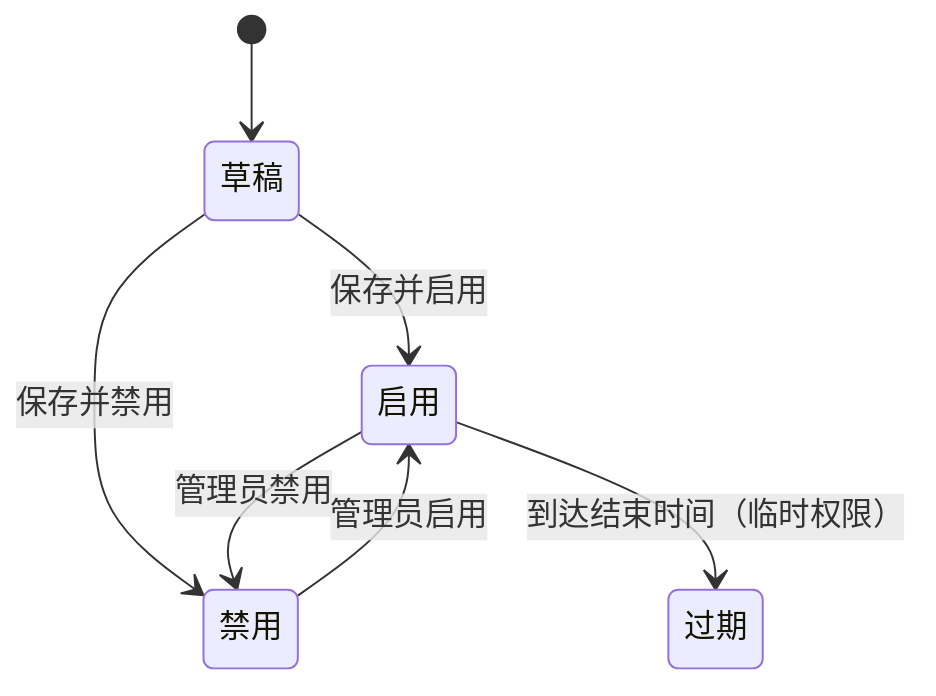

# 安全增强功能

## 一、功能卡片

| 字段 | 内容 |
| :--- | :--- |
| 功能 ID | F-SECURITY |
| 目标角色 | Super Admin / 安全管理员 |
| 对应问题/Job | P-003 精细化访问控制 / J-003 保障数据安全与外发合规 |
| 对应机会/需求 | R-019 ~ R-023 |
| 价值定位 | 差异化 |
| 目标版本 | VDI 5.9.8 EN |
| 优先级 | P0 |
| 状态 | 已发布 |

## 二、问题与目标

### 客户问题

企业需要按用户/虚拟机、客户端环境、登录条件动态调整桌面访问策略，临时开放文件/设备/应用权限，定义终端检查规则，并管理 Windows 自动更新。

### 产品目标

- 客户结果：管理员可以配置情景策略、临时权限、接入安全、应用特征和 Windows 自动更新策略。
- 业务结果：提升接入安全性和数据防泄露能力。
- 非目标：`[OUT]` 当前梳理未覆盖终端客户端侧的安全提示和阻断体验。

### 证据

- `[EVIDENCE]` 安全增强模块包含 5 个子菜单：情景策略、临时权限、接入安全、应用特征、Windows 自动更新。
- `[EVIDENCE]` 接入安全包含规则预定义、规则、用户级策略、角色级策略、高级设置。
- `[ASSUMPTION]` 临时权限到期后的自动回收机制需要验证。

## 三、主场景

### 场景：配置情景策略

- **场景说明**：管理员按登录 IP、客户端类型、登录页 URL、客户端 IP 等条件配置动态访问策略。
- **期望效果**：不同条件下的用户获得不同的虚拟桌面/远程应用策略或二次认证要求。
- **前置条件**：已维护用户/虚拟机对象和相关策略。
- **触发方式**：安全增强 > 情景策略 > 新建。
- **主流程**：
  1. 配置基础信息（名称、描述、区域、优先级、对象类型、对象）。
  2. 启用 VDC 配置，选择客户端条件（登录 IP 范围、客户端类型、登录页 URL、客户端 IP 范围）。
  3. 选择可调整动作（虚拟桌面与本地桌面策略、远程应用与会话桌面策略、二次认证、资源访问、分布式防火墙）。
  4. 保存策略。
- **异常/替代流程**：
  - 终端 IP 范围条件不适用于移动设备；依赖 IP 的限制可能被修改网卡地址绕过。
- **完成状态**：用户在不同条件下访问时触发对应策略。

### 场景：配置临时权限

- **场景说明**：管理员在指定时间段内向指定对象临时开放文件外发、USB 设备、应用访问等权限。
- **期望效果**：临时权限在有效期内生效，到期后自动回收。
- **前置条件**：已存在用户/用户组对象；报表中心已配置（如需审计）。
- **触发方式**：安全增强 > 临时权限 > 新建。
- **主流程**：
  1. 配置基础信息（名称、对象、区域、开始/结束时间、描述、优先级）。
  2. 配置文件外发权限（共享剪贴板、复制文本/文件、PC 硬盘、PC CD/DVD、USB 存储、USB CD/DVD、传输方向）。
  3. 配置外发内容审计（文件复制审计、文本复制审计、文件导出审计、大小限制、文件数限制等）。
  4. 配置 USB 设备白名单和应用访问控制。
  5. 保存。
- **异常/替代流程**：
  - 外发审计依赖报表中心，未配置时提示先配置报表中心。
- **完成状态**：对象在有效期内获得临时权限，操作被审计记录。

## 四、需求规格约束

### 4.1 信息与字段

#### 情景策略关键字段

| 字段 | 类型 | 必填 | 默认值 | 校验规则 | 权限/可见性 | 说明 |
| :--- | :--- | :---: | :--- | :--- | :--- | :--- |
| 名称 | String | 是 | - | 唯一 | Super Admin | 策略名称 |
| 对象类型 | Enum | 是 | 用户/用户组 | 用户/用户组/虚拟机 | Super Admin | - |
| 对象 | Multi-Select | 是 | - | 依赖对象类型 | Super Admin | 用户/虚拟机 |
| 客户端条件 | Multi-Enum | 否 | - | IP 范围/客户端类型/URL | Super Admin | 触发条件 |
| 动作 | Multi-Enum | 否 | - | 桌面策略/应用策略/二次认证/资源访问/分布式防火墙 | Super Admin | 命中后动作 |

#### 临时权限关键字段

| 字段 | 类型 | 必填 | 默认值 | 校验规则 | 权限/可见性 | 说明 |
| :--- | :--- | :---: | :--- | :--- | :--- | :--- |
| 名称 | String | 是 | - | 唯一 | Super Admin | 权限名称 |
| 对象 | Multi-Select | 是 | - | 本地用户/域用户/安全组/RADIUS 用户 | Super Admin | 授权对象 |
| 开始时间 | DateTime | 是 | 当前时间 | - | Super Admin | - |
| 结束时间 | DateTime | 是 | - | 晚于开始时间 | Super Admin | - |
| 文件外发权限 | Multi-Enum | 否 | - | - | Super Admin | 剪贴板/文件/设备/方向 |
| USB 白名单 | Table | 否 | - | VID:PID、设备类型、权限 | Super Admin | - |

#### 接入安全规则关键字段

| 规则类型 | 字段 | 说明 |
| :--- | :--- | :--- |
| 操作系统 | Windows 7/8/8.1/10/11、Windows Server、Linux、macOS | 支持最低 SP 条件 |
| 文件 | 文件存在/不存在、MD5、大小、允许更新滞后天数 | - |
| 进程 | 进程必须运行/不得运行、进程名、窗口名、MD5、大小 | - |
| 注册表 | 项存在/不存在、项、名称、值（DWORD/QWORD 用十进制） | - |
| 源 IP | 起始 IP、结束 IP | - |
| 登录时间 | 周一至周日 00:00-24:00 网格 | 仅支持 Windows 客户端 |
| 终端特征 | 硬件 ID、主机名、MAC 地址 | - |
| 客户端类型 | ARM、x86、Windows、移动端、macOS、Linux | - |

### 4.2 业务规则

1. 情景策略中终端 IP 范围条件不适用于移动设备；依赖 IP 的限制存在被绕过风险。
2. 临时权限中的文件导出审计启用后禁止普通文件/剪贴板外发，需通过虚拟机内文件导出工具。
3. 临时权限中的 USB 白名单：非存储设备包括打印机、文档扫描仪、扫描仪；存储设备包括 U 盘和移动硬盘。
4. 接入安全组合规则需所选基本规则全部满足才匹配；规则页中任意一个预定义规则满足即匹配。
5. 接入安全高级设置：登录前检查、登录后定时检查（1-60 分钟，默认 5 分钟）、失败动作注销。
6. Windows 自动更新与 AD 域 GPO/WSUS 配置可能冲突。

### 4.3 状态模型



### 4.4 权限矩阵

| 操作 | Super Admin | 安全管理员 | 普通管理员 |
| :--- | :---: | :---: | :---: |
| 查看情景策略/临时权限/接入安全 | ✅ | 待确认 | 待确认 |
| 新建/编辑安全策略 | ✅ | 待确认 | 待确认 |
| 删除安全策略 | ✅ | 待确认 | 待确认 |
| 启用/禁用 Windows 自动更新 | ✅ | 待确认 | 待确认 |
| 管理应用特征 | ✅ | 待确认 | 待确认 |

## 五、体验与原型

- 页面/入口：安全增强模块列表页 + 新建/编辑表单，接入安全包含多页签导航。
- 原型链接：待确认
- 空状态：当前环境存在少量预定义规则，部分列表为空。
- 加载状态：列表支持搜索、刷新、分页、列设置、优先级调整。
- 错误状态：依赖未配置时提示（如报表中心、WSUS 冲突）。
- 成功反馈：保存后返回列表。
- 可访问性/国际化：EN 控制台，中文需重新核对。

## 六、数据与指标

### 埋点/事件

| 事件 | 触发时机 | 属性 | 用途 |
| :--- | :--- | :--- | :--- |
| contextual_policy_create | 新建情景策略 | 条件类型、动作类型 | 统计策略创建 |
| temp_permission_create | 新建临时权限 | 权限类型、对象类型 | 统计临时权限创建 |
| access_security_rule_create | 新建接入安全规则 | 规则类型 | 统计规则创建 |
| wsus_policy_create | 新建 Windows 自动更新策略 | - | 统计更新策略创建 |

### 成功指标

| 指标 | 基线 | 目标 | 时间窗口 | 护栏指标 |
| :--- | :--- | :--- | :--- | :--- | :--- |
| 安全策略命中率 | 待确认 | 待确认 | 待确认 | 待确认 |
| 接入检查失败率 | 待确认 | 待确认 | 待确认 | 待确认 |
| 临时权限违规事件数 | 待确认 | 待确认 | 待确认 | 待确认 |

## 七、验收示例

```gherkin
场景: 情景策略按客户端 IP 范围生效
  假如 已配置情景策略，指定客户端 IP 范围并关联二次认证动作
  当 用户从该 IP 范围登录
  那么 系统要求二次认证
```

```gherkin
场景: 临时权限到期后自动回收
  假如 已创建临时权限，结束时间为 1 小时后
  当 超过结束时间后用户尝试使用被授权的外发权限
  那么 系统拒绝该操作
```

## 八、依赖、风险与待细化项

- 依赖：用户/虚拟机/角色对象、策略集、报表中心、文件存储服务器、WSUS 服务器、AD 域 GPO。
- 风险：策略配置错误导致合法用户被阻断；临时权限范围过大导致数据泄露；Windows 自动更新与 AD GPO 冲突。
- `[OPEN]` 临时权限到期后的自动回收机制及在线会话生效时机。
- `[OPEN]` 用户级策略与角色级策略同时命中时的优先级和合并规则。
- `[OPEN]` 接入检查失败时客户端实际提示、登录阻断与强制注销体验。
- `[BLOCKED]` 部分安全策略结果验证依赖允许变更的测试环境。
