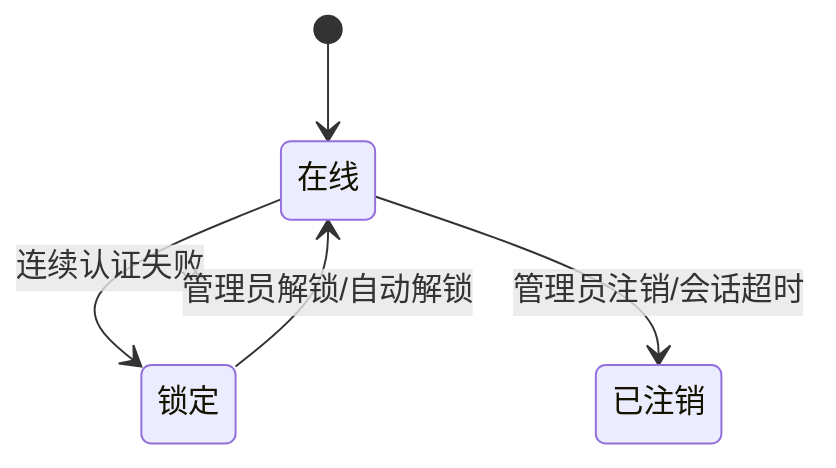

# 运维中心功能

## 一、功能卡片

| 字段 | 内容 |
| :--- | :--- |
| 功能 ID | F-OPERATIONS |
| 目标角色 | Super Admin / 运维管理员 |
| 对应问题/Job | P-004 监控与故障排查 / J-004 批量运维与升级 |
| 对应机会/需求 | R-024 ~ R-030 |
| 价值定位 | 门槛 |
| 目标版本 | VDI 5.9.8 EN |
| 优先级 | P0 |
| 状态 | 已发布 |

## 二、问题与目标

### 客户问题

IT 运维团队需要实时了解 VDI 服务运行状态、许可使用情况、告警、在线用户、远程应用状态，并能够快速处置异常会话、审批配置变更、排查故障。

### 产品目标

- 客户结果：管理员可以通过运维中心完成监控、告警、日志审计、故障排查和关键运维操作。
- 业务结果：提升 VDI 平台可观测性和故障恢复效率。
- 非目标：`[OUT]` 当前梳理未覆盖 HCI 侧的原生监控能力。

### 证据

- `[EVIDENCE]` 运维中心包含 9 个子菜单：概览、HCI 状态、远程应用状态、用户状态、审批、日志、故障排查、重启/关机、关于。
- `[EVIDENCE]` 日志模块包含 8 类日志：平台告警日志、操作告警日志、服务日志、审计日志、安全日志、系统日志、客户端用户日志、SBC 接入日志。
- `[ASSUMPTION]` 告警设置中的邮件/短信/SNMP Trap 配置需要实际邮件/短信网关支持。

## 三、主场景

### 场景：监控平台运行状态

- **场景说明**：管理员登录控制台后查看概览页，了解服务、许可、告警、资源、网络、连接和虚拟机运行概况。
- **期望效果**：管理员快速发现待处理事项和异常。
- **前置条件**：VDC 服务已运行并采集数据。
- **触发方式**：登录后默认进入 运维中心 > 概览。
- **主流程**：
  1. 查看 VDI 服务状态和待处理事项。
  2. 查看许可状态和有效期。
  3. 查看告警分级和描述。
  4. 查看资源利用率、网络连接、连接概览、虚拟机运行概览。
  5. 根据需要下钻到 HCI 状态、用户状态、日志等模块。
- **异常/替代流程**：
  - 服务异常 → 查看平台告警日志和服务日志。
- **完成状态**：管理员掌握当前平台运行状态。

### 场景：处置在线用户异常

- **场景说明**：管理员发现异常在线用户，执行注销、发送消息、流量设置或解锁操作。
- **期望效果**：异常用户会话被处置，平台恢复正常。
- **前置条件**：在线用户列表存在目标用户。
- **触发方式**：运维中心 > 用户状态。
- **主流程**：
  1. 搜索并选择目标用户。
  2. 执行注销、发送消息、流量设置或解锁操作。
  3. 确认影响范围并提交。
- **异常/替代流程**：
  - 误操作影响大量用户 → 操作前需二次确认。
- **完成状态**：目标用户会话被处置。

### 场景：故障排查

- **场景说明**：管理员通过 Web 控制台命令或抓包工具排查网络/服务故障。
- **期望效果**：定位并解决故障。
- **前置条件**：具备网络诊断权限。
- **触发方式**：运维中心 > 故障排查。
- **主流程**：
  1. 在 Web 控制台输入受限诊断命令（help、ping、traceroute、telnet、ifconfig 等）。
  2. 或使用抓包工具选择网卡、配置过滤器、开始抓包。
  3. 查看抓包历史文件。
- **异常/替代流程**：
  - 抓包达到 10000 个数据包后停止；最多保存 5 个抓包文件。
- **完成状态**：获得诊断数据并定位问题。

## 四、需求规格约束

### 4.1 信息与字段

#### 概览关键指标

| 模块 | 指标 | 说明 |
| :--- | :--- | :--- |
| VDI 服务 | 服务运行状态、待处理事项、配置变更请求、硬件 ID | - |
| 许可 | 激活状态、并发用户许可、第三方瘦客户机许可、有效期 | - |
| 告警 | 总数、严重/主要/次要分级、描述和时间 | - |
| VDC 资源利用率 | 集群可靠性、资源使用情况 | - |
| VDC 网络连接 | 状态、IP、上下行吞吐量、趋势 | 时间/线路/单位筛选 |
| 连接概览 | 在线用户、授权使用量、锁定用户、并发趋势 | 时间筛选 |
| 虚拟机 | 虚拟机运行概览 | 查看详情 |

#### 用户状态关键字段

| 字段 | 类型 | 必填 | 默认值 | 校验规则 | 权限/可见性 | 说明 |
| :--- | :--- | :---: | :--- | :--- | :--- | :--- |
| 用户名 | String | - | - | - | Super Admin | - |
| 上行/下行速率 | Number | - | - | - | Super Admin | 实时流量 |
| 登录时间 | DateTime | - | - | - | Super Admin | - |
| 认证方式 | String | - | - | - | Super Admin | - |

#### 日志关键字段

| 日志类型 | 字段 | 查询/操作 |
| :--- | :--- | :--- |
| 平台告警日志 | 严重程度、时间、模块、描述、原因、操作 | 模块/严重度筛选、设置、导出、删除、清空 |
| 操作告警日志 | 用户名、角色类型、客户端、IP、MAC、操作、时间、结果、描述、风险等级、动作类型 | 关键字/时间范围、导出、清空 |
| 服务日志 | 服务、类型、时间、详情 | 关键字/时间范围、导出、黑匣子、清空 |
| 审计日志 | 用户名、角色类型、用户 IP、操作、节点 IP、时间、对象、结果、描述、风险等级、动作类型、保留项 | 操作类型/时间范围、导出、黑匣子、清空 |
| 安全日志 | 用户名、时间、对象类型、IP、对象、描述、结果、风险等级、动作类型 | 时间范围、导出、清空 |
| 系统日志 | 服务、类型、时间、详情、调试日志 | 关键字/时间范围、导出、黑匣子、清空 |
| 客户端用户日志 | 用户名、客户端、IP、MAC、操作、时间、结果、描述 | 关键字/时间范围、导出、清空 |
| SBC 接入日志 | 用户名、IP、资源名称、时间、操作 | 关键字/时间范围 |

### 4.2 业务规则

1. 概览、HCI 状态、远程应用状态、用户状态等页面支持自动刷新（不刷新/10 秒/20 秒/30 秒/1 分钟/5 分钟/30 分钟）。
2. 用户状态操作（注销、发送消息、流量设置、解锁）会影响在线用户，需二次确认。
3. 重启/关机/停止 VDI 服务等操作需输入当前 admin 密码确认。
4. 抓包达到 10000 个数据包后停止，最多保存 5 个抓包文件，超过后覆盖最早文件。
5. 告警设置包含告警项、告警触发条件、通知（邮件/短信/SNMP Trap）三个页签。

### 4.3 状态模型



### 4.4 权限矩阵

| 操作 | Super Admin | 运维管理员 | 普通管理员 |
| :--- | :---: | :---: | :---: |
| 查看概览/状态/日志 | ✅ | 待确认 | 待确认 |
| 结束会话/注销用户 | ✅ | 待确认 | 待确认 |
| 审批配置变更 | ✅ | 待确认 | 待确认 |
| 配置告警通知 | ✅ | 待确认 | 待确认 |
| 执行 Web 控制台命令/抓包 | ✅ | 待确认 | 待确认 |
| 重启/关机/停止 VDI 服务 | ✅ | 待确认 | 待确认 |

## 五、体验与原型

- 页面/入口：运维中心左侧菜单 + 右侧内容区，概览为卡片式看板。
- 原型链接：待确认
- 空状态：部分列表（如 HCI 状态、锁定用户、审批）当前无数据。
- 加载状态：支持自动刷新和手动刷新。
- 错误状态：依赖服务未运行或权限不足时显示异常提示。
- 成功反馈：操作后显示确认或任务状态。
- 可访问性/国际化：EN 控制台，中文需重新核对。

## 六、数据与指标

### 埋点/事件

| 事件 | 触发时机 | 属性 | 用途 |
| :--- | :--- | :--- | :--- |
| admin_logout_user | 管理员注销用户 | 数量、原因 | 统计运维操作 |
| admin_end_session | 管理员结束会话 | 类型 | 统计会话处置 |
| alert_ack | 告警确认 | 模块、严重度 | 统计告警处理 |
| packet_capture_start | 开始抓包 | 网卡、过滤器 | 统计排障操作 |

### 成功指标

| 指标 | 基线 | 目标 | 时间窗口 | 护栏指标 |
| :--- | :--- | :--- | :--- | :--- |
| MTTR（平均恢复时间） | 待确认 | 待确认 | 待确认 | 待确认 |
| 告警响应率 | 待确认 | 待确认 | 待确认 | 待确认 |
| 误操作事件数 | 待确认 | 待确认 | 待确认 | 待确认 |

## 七、验收示例

```gherkin
场景: 管理员查看概览并发现告警
  假如 平台存在严重告警
  当 管理员进入运维中心 > 概览
  那么 概览页显示告警总数和分级
```

```gherkin
场景: 管理员重启 VDI 服务
  假如 管理员已登录 Super Admin
  当 管理员在 运维中心 > 重启/关机 选择重启服务
  那么 系统要求输入 admin 密码确认
```

## 八、依赖、风险与待细化项

- 依赖：VDC 服务、HCI 平台、邮件/短信网关、SNMP Trap 接收端、Syslog/报表中心。
- 风险：高权限运维操作（注销用户、结束会话、重启服务）可能误影响业务；日志删除/清空导致审计缺失。
- `[OPEN]` 不同管理员角色的运维操作权限边界。
- `[OPEN]` 告警通知的 SMTP/SNMP/短信网关配置细节。
- `[BLOCKED]` 部分高权限操作的结果验证依赖允许变更的测试环境。
