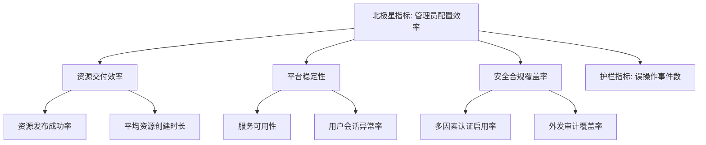

# 指标、实验与反馈

## 一、指标树

| 层级 | 指标 | 定义/公式 | 基线 | 目标 | 数据源 | 更新频率 | Owner |
| :--- | :--- | :--- | :--- | :--- | :--- | :--- | :--- |
| 北极星 | 管理员配置效率 | 完成标准配置所需步骤数/时间 | 待确认 | 待确认 | 埋点/可用性测试 | 每版本 | 待确认 |
| 领先指标 | 资源发布成功率 | 成功创建并关联用户的资源数 / 总创建资源数 | 待确认 | 待确认 | 服务日志 | 每周 | 待确认 |
| 领先指标 | 用户登录成功率 | 成功登录次数 / 总登录尝试次数 | 待确认 | 待确认 | 审计日志 | 每周 | 待确认 |
| 领先指标 | 多因素认证启用率 | 启用 MFA 的用户数 / 总用户数 | 待确认 | 待确认 | 用户/认证配置 | 每月 | 待确认 |
| 护栏指标 | 误操作事件数 | 管理员高权限误操作导致的服务中断/数据丢失事件数 | 0 | 0 | 运维日志 | 实时 | 待确认 |
| 护栏指标 | 安全策略阻断率 | 因策略配置错误导致的合法访问被阻断事件数 | 待确认 | 待确认 | 安全日志 | 每周 | 待确认 |

## 二、假设清单

| ID | 假设 | 重要性 | 不确定性 | 证据现状 | 验证方式 | 状态 |
| :--- | :--- | :---: | :---: | :--- | :--- | :--- |
| H-001 | 如果提供向导式资源配置，那么管理员配置效率将显著提升 | 5 | 4 | 当前配置路径长、字段多 | 可用性测试/A-B 测试 | 待验证 |
| H-002 | 如果提供策略影响范围预览，那么策略冲突和误阻断事件将减少 | 5 | 4 | 当前策略优先级/对象关系复杂 | 可用性测试/试点 | 待验证 |
| H-003 | 如果提供认证方案模板，那么认证配置错误率将降低 | 4 | 3 | 14 种认证子页组合复杂 | 可用性测试 | 待验证 |
| H-004 | 如果统一告警与日志检索，那么 MTTR 将缩短 | 4 | 3 | 当前 8 类日志分散 | 试点/指标对比 | 待验证 |
| H-005 | 如果提供变更影响范围提示，那么高权限误操作将减少 | 5 | 3 | 当前删除/更新/启停操作风险高 | A-B 测试/指标对比 | 待验证 |

## 三、实验计划

| 实验 ID | 假设 | 方法 | 目标人群 | 样本/周期 | 成功阈值 | 护栏 | 开始/结束 | Owner |
| :--- | :--- | :--- | :--- | :--- | :--- | :--- | :--- | :--- |
| EXP-001 | H-001 | 可用性测试 | 5-10 名管理员 | 2 周 | 配置步骤减少 30% 或主观满意度提升 | 错误率不上升 | 待确认 | 待确认 |
| EXP-002 | H-002 | 原型测试 | 5-10 名安全管理员 | 2 周 | 80% 参与者能正确预判策略影响范围 | 无 | 待确认 | 待确认 |
| EXP-003 | H-003 | A-B 测试 | 真实管理员用户 | 1 个月 | 认证配置工单减少 20% | 登录失败率不上升 | 待确认 | 待确认 |
| EXP-004 | H-004 | 试点 | 2-3 个客户 | 1 个月 | MTTR 降低 15% | 误操作事件数不增加 | 待确认 | 待确认 |
| EXP-005 | H-005 | A-B 测试 | 真实管理员用户 | 1 个月 | 误操作事件数减少 50% | 操作完成率不下降 | 待确认 | 待确认 |

## 四、实验结果

| 实验 | 结果摘要 | 数据 | 结论 | 决策 | 后续动作 |
| :--- | :--- | :--- | :--- | :--- | :--- |
| 待补充 | - | - | - | - | - |

## 五、反馈池

| ID | 日期 | 来源 | 角色/客户 | 反馈 | 类型 | 严重度 | 关联功能 | 处理结论 |
| :--- | :--- | :--- | :--- | :--- | :--- | :--- | :--- | :--- |
| FB-001 | 2026-07-13 | 界面梳理 | Super Admin | 认证模块 14 个子页配置路径长，容易遗漏依赖 | 问题 | 中 | F-SERVICE | 待验证 H-003 |
| FB-002 | 2026-07-13 | 界面梳理 | Super Admin | 策略集对象关系复杂，无法预览影响范围 | 问题 | 高 | F-POLICY | 待验证 H-002 |
| FB-003 | 2026-07-13 | 界面梳理 | Super Admin | 删除/更新/启停高风险操作缺乏影响范围提示 | 问题 | 高 | F-ASSET/F-POLICY/F-SECURITY | 待验证 H-005 |
| FB-004 | 2026-07-13 | 界面梳理 | Super Admin | 8 类日志分散，缺乏统一检索和关联分析 | 问题 | 中 | F-OPERATIONS | 待验证 H-004 |
| FB-005 | 2026-07-13 | 界面梳理 | Super Admin | 资源创建字段多，依赖关系不清晰 | 问题 | 高 | F-ASSET/F-SERVICE | 待验证 H-001 |

## 六、发布复盘

- 是否达成客户结果：待确认（当前处于界面梳理阶段，未发布）。
- 是否达成业务目标：待确认。
- 护栏指标是否异常：待确认。
- 哪些假设被证实/推翻：待补充。
- 下一轮规划调整：待补充。
- `[OPEN]` 需要与真实客户/管理员进行可用性访谈以验证假设。
- `[OPEN]` 需要建立埋点和数据看板以持续跟踪指标。
