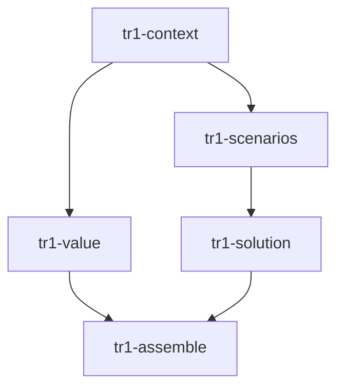

# cospec DAG Planner

**Skill 标识**: `cospec-dag-planner`

其他 skill 通过 `cospec-dag-planner` 引用本 skill。

本 skill 负责把一次产品规划文档生成任务拆分为可并行执行的文档片段（section/chapter/ID cluster），生成 cospowers 风格的调度产物：`index.md`、`dag.json`、以及每个子 Agent 的 `task card`。

## When to Use

- 当前 stage 或子 skill 被配置为并行生成模式（`cospec.config.json` 中 `parallel.enabled=true` 且对应 stage 为 `true`）。
- 未来新增的 cospec 子 skill 需要把文档拆成多个部分并行产出。
- 目标文档足够大，拆分为独立章节后收益明显高于串行撰写。

## Input Contract

调用方必须提供以下信息（通过对话或 artifact paths）：

1. **stage**: 当前阶段标识，例如 `tr1-requirements-spec`、`user-journey-design`、或未来自定义子 skill 名称。
2. **output_template_path**: 输出文档模板路径（来自 `cospec.config.json` 的 `templates`）。
3. **input_artifacts**: 上游输入文件路径列表（例如用户旅程文档、澄清结论、DCP2-1 材料）。
4. **output_path**: 最终组装文档的目标路径。
5. **decomposition_hint** (可选): 调用方偏好的拆分维度，例如 `by-chapter`、`by-id-cluster`、`by-playbook`。

## Output Contract

本 skill 必须写入以下产物到 `.cospec/plans/YY-MM-DD-<project>/`：

```text
.cospec/plans/YY-MM-DD-<project>/
  index.md              # 人类可读的总计划
  dag.json              # 机器可读的任务依赖图
  tasks/<task-id>.md    # 每个 section writer 的 task card
```

### `index.md` structure

```markdown
# [Stage] Parallel Document Plan

**Goal:** [一句话说明要生成什么文档]
**Stage:** [stage name]
**Output:** [output_path]
**Template:** [output_template_path]

## Scheduling artifacts
- DAG: `.cospec/plans/YY-MM-DD-<project>/dag.json`
- Task cards: `.cospec/plans/YY-MM-DD-<project>/tasks/`

## Task DAG



## Tasks

### [task-id]

**Task card:** `.cospec/plans/YY-MM-DD-<project>/tasks/[task-id].md`
**Depends on:** [deps or "(none)"]
**Produces manifest:** `.cospec/tasks/[task-id]/manifest.json`
```

### `dag.json` schema

```json
{
  "project": "<project>",
  "plan_file": ".cospec/plans/YY-MM-DD-<project>/index.md",
  "tasks": [
    {
      "id": "tr1-context",
      "task_file": ".cospec/plans/YY-MM-DD-<project>/tasks/tr1-context.md",
      "depends_on": [],
      "produces": [".cospec/tasks/tr1-context/manifest.json"]
    }
  ]
}
```

每个 task 必须包含：`id`、`task_file`、`depends_on`、`produces`。

### Task card schema

```markdown
# Task: <task-id>

## Source
[模板章节 / 上游输入路径]

## Depends on
[task ids, or none]

## Input Artifacts
- [上游 manifest 路径，或 none]

## Task Spec
[本任务生成哪个文档片段]

## Interface Contract
[对下游稳定的约定：ID 前缀、标题层级、表格格式、术语一致]

## Deliverables
[必须产出的 markdown 章节 / 表格 / ID 集合]

## Acceptance Criteria
- 无占位符（TBD / TODO / "稍后补充"）。
- 覆盖 Source 中所有条目。
- 与上游 manifest 中的 contract 保持一致。

## Required Output Artifacts
- `.cospec/tasks/<task-id>/manifest.json`
- `.cospec/tasks/<task-id>/results.md`
- `.cospec/tasks/<task-id>/contract.json`
- `.cospec/tasks/<task-id>/changed-files.txt`
```

## Workflow

1. **加载输入** —— 读取 `output_template_path` 和 `input_artifacts`，理解目标文档结构。
2. **拆分为 section 任务** —— 调用 `section-extractor` 子代理，或在本 skill 内直接拆分。
3. **构建 DAG** —— 为每个 section 分配 `id`、`depends_on`、`produces`，确保无环。
4. **写入产物** —— 写入 `index.md`、`dag.json`、`tasks/<task-id>.md`。
5. **自检** —— 验证：
   - 所有 task id 唯一。
   - 所有 `depends_on` 指向存在的 task id。
   - DAG 无环（prompt-based 检查）。
   - 所有 `task_file` 路径已写入。
6. **返回** —— 报告 plan directory 路径与任务数量。

## Section Extraction Rules

优先按以下维度拆分，以最大化并行度：

| 拆分维度 | 适用场景 | 示例 |
|---|---|---|
| by-chapter | 大需求评审版、AI 上下文版 | 背景、价值、场景、方案、Demo、风险 |
| by-id-cluster | AI 上下文版 | REQ/VAL 簇、EPIC/FEAT 簇、ST/AC 簇、OBJ/INT 簇 |
| by-playbook | 用户旅程 | 每个 playbook 或用户角色一条任务 |
| by-aspect | 需求澄清 | 业务背景、边界异常、下游影响、假设待确认 |

依赖最小化规则：

- 仅当 section B 必须引用 section A 的**已确定结论**时，才建立 A → B 依赖。
- 可通过提取共享 contract 解决的依赖，应拆分为独立的 `foundation` / `contract` 任务。
- 最终必须有一个 `assemble` 任务，依赖所有 section 任务，负责合并与一致性润色。

## No Placeholder Rule

计划产物中不允许出现：

- "TBD"、"TODO"、"稍后实现"、"补充细节"
- "添加适当的..." / "处理边界情况" 等模糊描述
- 引用未在任何任务中定义的 ID、术语或格式

## Red Flags

- Do NOT create dependencies just because sections appear in the same template.
- Do NOT split a document so finely that assembly becomes meaningless.
- Do NOT omit the final `assemble` task.
- Do NOT dispatch the executor directly from this skill.
- Do NOT paste full input documents into task cards; task cards must be independently readable by subagents with only artifact paths.

## Integration

本 skill 不直接调用执行器。典型调用链：

```text
caller skill
    -> cospec-dag-planner         (writes plan artifacts)
    -> [optional] cospec-dag-evaluator
    -> cospec-dag-executor        (dispatches section writers and assembler)
```

## Agent Prompt

调度 `section-extractor` 子代理时使用：
`skills/cospec-dag-planner/agents/section-extractor-prompt.md`
